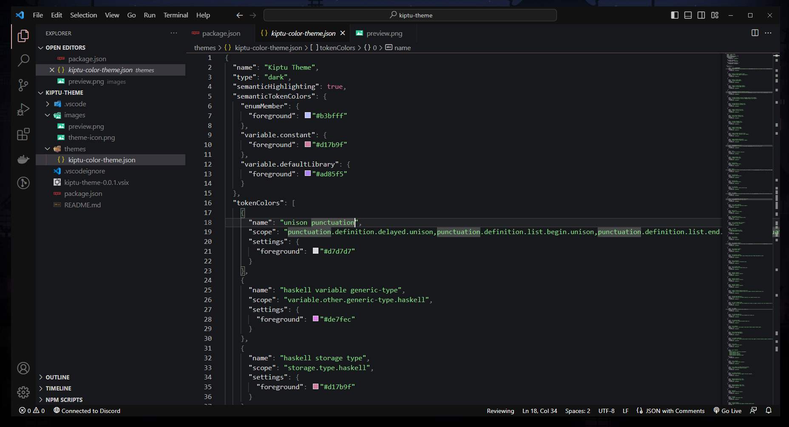

<div align="center">
 
```php
                                                
_  _ _ ___  ___ _  _    _  _ ____ ____ ____ ___  ____ 
|_/  | |__]  |  |  |    |  | [__  |    |  | |  \ |___ 
| \_ | |     |  |__|     \/  ___] |___ |__| |__/ |___ 
                                                
Settings, Extensions and Theme for VSCode
 
```
 
</div>

## <samp>INSTALLATION</samp>
- Run the `setup.cmd` file to install everything at once

## <samp>MANUAL INSTALLATION</samp>

#### Theme
- Run the `setup-theme.cmd` file
- _Alternatively:_ Run the command `code --install-extension <vsix-file>` in the terminal

#### Extensions
- Run the `setup-extensions.cmd` file
- _Alternatively:_ Open the location containing the `.vscode` folder in VSCode and install the recommended extensions

#### Settings
- Run the `setup-settings.cmd` file
- _Alternatively:_ Copy the contents of the `settings.json` file into your own by opening the command palette (`F1`) and typing `Preferences: Open Settings (JSON)`

## <samp>THEME PREVIEW</samp>

<div align="center">
    
</div>

<div align="right">

<br>

```
Kiptu Software Labs 💜
```

</div>